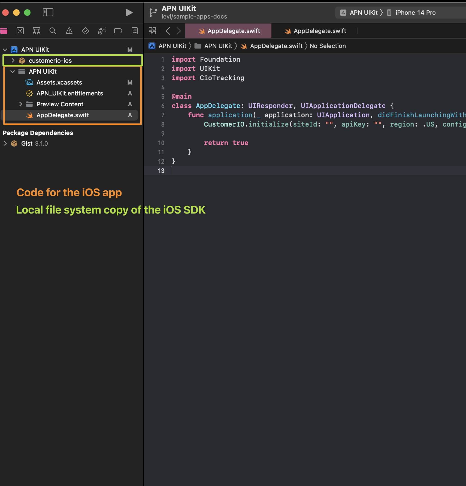

# Sample apps 

# Compile a sample app

1. Run this command with `app` having the name of the directory in `Apps/` that you want to compile.  
```
make setup app=CocoaPods-FCM
```

2. Open project in Xcode and compile. 


All of the sample apps should be able to open in Xcode to compile. 

# Create a new sample app 

* In Xcode, create a new iOS app. Put the iOS app in a new directory inside of `Apps/` directory of this repository. There are examples in this repository that you can reference. 

* [Setup code signing for this new iOS app](https://github.com/customerio/apple-code-signing#creating-a-new-ios-app). 

* Copy the directory: `Apps/CocoaPods-FCM/fastlane/` into your new iOS sample app's directory. These files are required in order for the CI server to compile the sample app. Go through each of the files and edit them to values that are correct for your new iOS app. 

* Copy the file: `Apps/CocoaPods-FCM/BuildEnvironment.sample.swift` into your new iOS sample app's directory. This file is used during development and CI builds to set the Customer.io workspace credentials at compile time. 

* Time to install the Customer.io SDK into the Xcode project. All sample apps are meant to install the *local copy on the file system* of the SDK instead of a version of the SDK in production. 

Note: It's preferred to use Swift Package Manager instead of CocoaPods but some sample apps need to use CocoaPods so we can test that environment customers may have. 

**If your new sample app uses CocoaPods**, then copy the `Podfile` from `../Apps/CocoaPods-FCM/Podfile`. That file is designed to always install the SDK from the local copy of the SDK which is what all of our sample apps should be doing. 

**If your new sample app uses Swift Package Manager**, you need to [follow these steps](https://developer.apple.com/documentation/xcode/editing-a-package-dependency-as-a-local-package#Overview). By following those steps, you will (1) install the CIO SDK inside of Xcode as you normally would. Installing a production version of the SDK. Then, you will drag+drop the CIO SDK directory on your computer into Xcode which then *overrides* the production version of the SDK. This means that Xcode will now compile the iOS app using the *local* copy of the SDK instead of production copy. After you are done, this is what Xcode should look like: 



* Open `../.github/workflows/build-sample-apps.yml`. In this file, you will see code that looks like this:

```yml
    ...
    matrix: # Use a matrix allowing us to build multiple apps in parallel. Just add an entry to the matrix and it will build! 
      sample-app: 
      - "Foo"
```

Add a new entry to this list. The value will be the new directory that you created inside of `Apps/`. For example, if the new iOS app you made is inside of: `Apps/CocoaPods-FCM/`, then add this entry to this file:

```yml
    ...
    matrix: # Use a matrix allowing us to build multiple apps in parallel. Just add an entry to the matrix and it will build! 
      sample-app: 
      - "CocoaPods-FCM"
```

When you make a pull request for the new sample app that you created, you should see this app get compiled by the CI server. 

