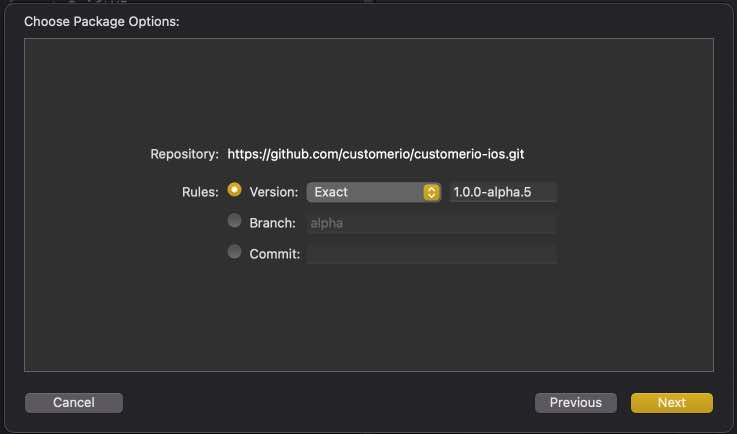
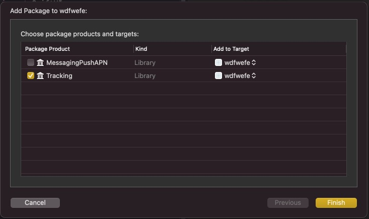
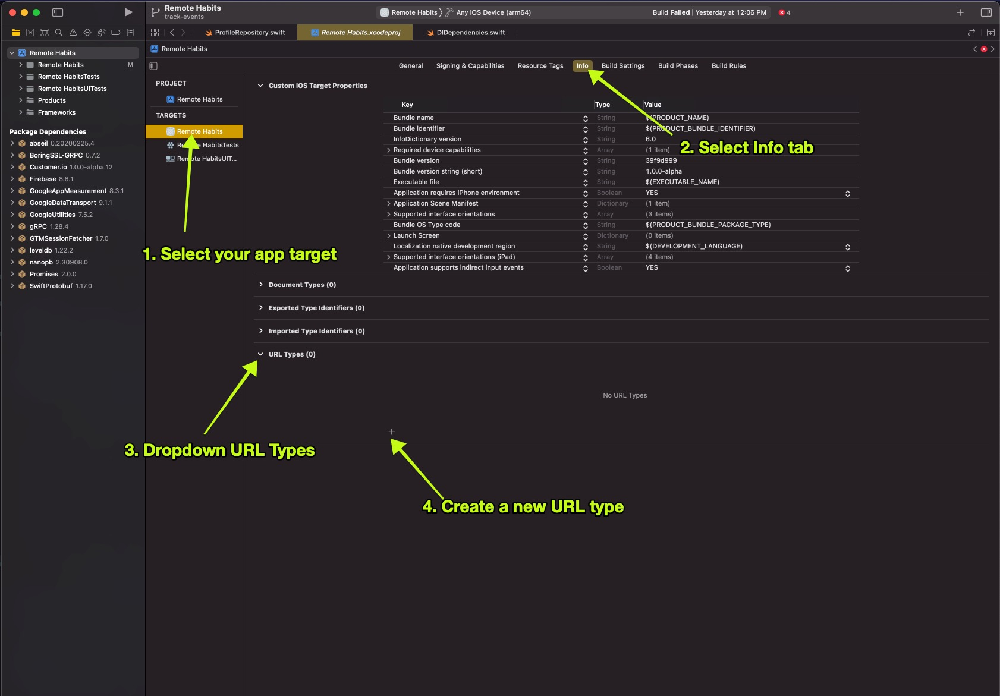
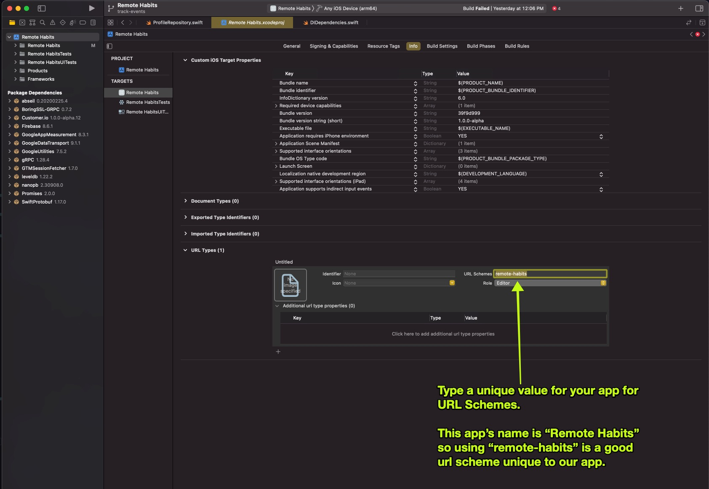

[s-tracking]: https://github.com/customerio/customerio-ios/blob/1.0.0-alpha.5/Sources/Tracking/Tracking.swift
[s-cioerror]: https://github.com/customerio/customerio-ios/blob/1.0.0-alpha.5/Sources/Tracking/CustomerIOError.swift
[s-ciomock]: https://github.com/customerio/customerio-ios/blob/1.0.0-alpha.5/Sources/Tracking/autogenerated/AutoMockable.generated.swift#L101-L152
[s-trackingmock]: https://github.com/customerio/customerio-ios/blob/1.0.0-alpha.5/Sources/Tracking/autogenerated/AutoMockable.generated.swift#L687-L692
[s-cioerrorparse]: https://github.com/customerio/RemoteHabits-iOS/blob/1.0.0/Remote%20Habits/Util/CustomerIOErrorUtil.swift


[](code_of_conduct.md) 

# Customer.io iOS SDK

**This is a work in progress!** While we're *very* excited about it, it's still in its alpha phase; it is not ready for general availability. If you want to try it out, contact [product@customer.io](mailto:product@customer.io) and we'll help set you up!

Before you get started, keep in mind:
1. **The SDK has been tested on iOS devices**. It might work on other Apple devices—macOS, tvOS, and watchOS—but we have not officially tested, nor do we officially support, non-iOS devices.
2. **The SDK is in its `alpha` phase**. Feel free to try it out, but please understand that we will likely introduce breaking changes to the API and may experience bugs. 

# Get started

To get started, you need to install and initialize the relevant SDK packages in your project. 

To minimize our SDK's impact on your app's size, we offer multiple, separate SDKs. You should only install the packages that you need for your project. 

> Tip: Check out our [sample iOS app, Remote Habits](https://github.com/customerio/RemoteHabits-iOS), for a real-world example of how to use our SDK. 

## Install the SDK

Use the Swift Package Manger to install our SDKs into your project.

1. In Xcode, go to **File** > **Swift Packages** > **Add Package Dependency**

2. In the window that appears, enter the iOS SDK's GitHub repository: 

```
https://github.com/customerio/customerio-ios.git
```

3. Select the version that you want to install. While the SDK is its alpha stage, we recommend that you install *an exact* version of the SDK instead of indicating a range. This prevents you from automatically upgrading to a newer alpha version and possibly installing breaking changes on your code base. 



4. Lastly, choose the SDK products that you want to install. You can start by selecting `Tracking` for now and adding others later if you need them. 



## Initialize the SDK

Before you can use the Customer.io SDK, you need to initialize it. Any calls that you make to the SDK before you initialize it are ignored. 

There are two ways to initialize the SDK. The method you use depends on how you want to use the SDK:

1. Singleton, shared instance (the quick and easy way):

When you use the shared instance, you don't need to manage your own instances of Customer.io SDK classes. To get started, initialize the SDK in the `AppDelegate` `application(_ application: didFinishLaunchingWithOptions)` function: 

```swift
import CioTracking

class AppDelegate: NSObject, UIApplicationDelegate {
    func application(
        _ application: UIApplication,
        didFinishLaunchingWithOptions launchOptions: [UIApplication.LaunchOptionsKey: Any]? = nil
    ) -> Bool {
        CustomerIO.initialize(siteId: "YOUR SITE ID", apiKey: "YOUR API KEY")

        // You can optionally provide a Region to set the Region for your Workspace:
        CustomerIO.initialize(siteId: "YOUR SITE ID", apiKey: "YOUR API KEY", region: Region.EU)

        return true
    }
}
```

Then, when you want to use any of the SDK features, you use the shared instance of the class:

```swift
MessagingPush.shared.application(...)
```

2. Create your own instances (better for projects using automated tests):

We recommend that you create your own instances of SDK classes if your project has automated tests. We designed our SDK with first-class support for dependency injection and mocking, which makes it easier to write automated tests. See [testing](#Testing) for more information.

> **Note**: Code samples in this readme use the singleton, shared instance method to call the SDK. However, all samples will also work with your own instances of SDK classes.

```swift
import CioTracking

let customerIO = CustomerIO(siteId: "XXX", apiKey: "YYY")

// You can optionally provide a Region to set the Region for your Workspace:
let customerIO = CustomerIO(siteId: "XXX", apiKey: "YYY", region: Region.EU)
```

Then, when you want to use any of the SDK features, you use the shared instance of the class:

```swift
let messagingPush = MessagingPush(customerIO: customerIO)

messagingPush.application(...)
```

# Tracking

## Identify a customer

When you identify a customer, you:
1. Add or update the customer's profile in your workspace.
2. Save the customer's information on the device. Future calls to the SDK are linked to the last-identified customer. For example, after you identify a person, any events that you track are automatically associated with that person.

You can only identify one customer at a time. The SDK "remembers" the most recently-identified customer.
If you identify customer "A", and then call the identify function for customer "B", the SDK "forgets" customer "A" and assumes that customer "B" is the current app user. 

[Learn more about the `Tracking` class][s-tracking].

```swift
import CioTracking

// - identifier: The unique value representing a person. The value you use may be an id, email address 
//               or the cio_id (when updating people), depending on your workspace settings. 
// - body: (Optional) The request body to send to the Customer.io API used to add attributes to a profile 
//         or updating an existing profile. https://customer.io/docs/api/#operation/identify
// - onComplete: Asynchronous callback with the result of the SDK attempting to identify the profile. 
// - jsonEncoder: (Optional) Custom `JSONEncoder` that you want to use to encode the `body` parameter. 
// default: https://github.com/customerio/customerio-ios/blob/1.0.0-alpha.5/Sources/Tracking/Util/JsonAdapter.swift#L38-L43
CustomerIO.shared.identify(identifier: "989388339", body: ["first_name": firstName]) { [weak self] result in
    // It's recommended to use `[weak self]` in the callback but your app's use cases may be unique. 
    guard let self = self else { return }
    
    switch result {
    case .success: 
      // Customer successfully identified in your Workspace!
      break 
    case .failure(let customerIOError):
      // Error occurred. It's recommended you parse the `customerIOError` to learn more about the error.
      break 
    }
}

// The parameter `body` accepts many different forms. 
// 1. A dictionary:
let body = ["first_name": "Dana", "last_name": "Green"]
CustomerIO.shared.identify(identifier: "989388339", body: body)
// 2. A `Encodable` object:
struct IdentifyRequestBody: Encodable {
  let firstName: String
  let lastName: String
}
CustomerIO.shared.identify(identifier: "989388339", body: IdentifyRequestBody(firstName: "Dana", lastName: "Green"))
// More complex example: https://github.com/customerio/customerio-ios/blob/1.0.0-alpha.5/Tests/Shared/IdentifyRequestBody.swift
```

> Tip: See [Error handling](#Error-handling) to learn more about how to parse the `CustomerIOError`. 

## Track a custom event

Once you've identified a customer, you can use the `track` method to capture customer activity and send it Customer.io, optionally supplying event data with your request

```swift
import CioTracking

// - name: the name of the event to track
// - data: (Optional) The event body to send as an Encodable object. If not specified it will default to `{}`
// - jsonEncoder: (Optional) Custom `JSONEncoder` that you want to use to encode the `body` parameter. 
// default: https://github.com/customerio/customerio-ios/blob/1.0.0-alpha.5/Sources/Tracking/Util/JsonAdapter.swift#L38-L43
// - onComplete: Asynchronous callback with the result of the SDK attempting to identify the profile. 
CustomerIO.shared.track(name: "logged_in", data: ["ip": "127.0.0.1"]){ [weak self] result in
    // It's recommended to use `[weak self]` in the callback but your app's use cases may be unique. 
    guard let self = self else { return }

    switch result {
    case .success: 
      // Successfully tracked an event in your workspace!
      break 
    case .failure(let customerIOError):
      // Error occurred. It's recommended you parse the `customerIOError` to learn more about the error.
      break 
    }
}

// The `data` parameter can be optionally skipped
CustomerIO.shared.track(name: "played_game")

// If specified the `data` accepts any `Encodable` object that generates a hash, this could be:

// 1. A dictionary:
let data = ["product": "socks", "price": "23.45"]
CustomerIO.shared.track(name: "purchase", data: data)

// 2. A custom `Encodable` type:
struct Purchase: Encodable {
  let product: String
  let price: Double
}
CustomerIO.shared.track(name: "purchase", data: Purchase(product: "socks", price: 23.45))
```

## Stop identifying a customer

In your app you may need to stop identifying a profile in the Customer.io SDK. There are 2 ways to do that:

1. Call the `identify()` function which will stop identifying the previously identified profile (if there was one) and remember this new profile.
2. Use `clearIdentify()` to stop identifying the previously identified profile (if there was one). 

```swift
// All future calls you make to the Customer.io SDK will be ignored until you identify a new profile. 
CustomerIO.shared.clearIdentify()
```

# Push notifications 

Want to send push notification messages to your customer's devices? Great!

The Customer.io SDK supports sending push notifications via APN or FCM. 

## Getting started APN

1. Install the SDK `MessagingPushAPN` using Swift Package Manager. Follow the [Install the SDK](#install-the-sdk) instructions to learn more. 

2. Setup the APN service by enabling Push Notifications in XCode under App > Capabilities.

3. After initializing the SDK, register for remote push to receive a device token from APN. Then, call the Customer.io SDK to add the token to the user profile:

```swift
import CioMessagingPushAPN
   
class AppDelegate: NSObject, UIApplicationDelegate {
   
    func application(
        _ application: UIApplication,
        didFinishLaunchingWithOptions launchOptions: [UIApplication.LaunchOptionsKey: Any]? = nil
    ) -> Bool {
        CustomerIO.initialize(siteId: "YOUR SITE ID", apiKey: "YOUR API KEY")

        // You can optionally provide a Region to set the Region for your Workspace:
        CustomerIO.initialize(siteId: "YOUR SITE ID", apiKey: "YOUR API KEY", region: Region.EU)

        // It's good practice to always register for remote push when the app starts.
        // This asserts that the Customer.io SDK always has a valid APN device token to use.
        UIApplication.shared.registerForRemoteNotifications()

        return true
    }
     
    func application(_ application: UIApplication, didRegisterForRemoteNotificationsWithDeviceToken deviceToken: Data) {
       MessagingPush.shared.application(application, didRegisterForRemoteNotificationsWithDeviceToken: deviceToken) { [weak self] result in 
         // It's recommended to use `[weak self]` in the callback but your app's use cases may be unique. 
         guard let self = self else { return }
   
         switch result {
         case .success: 
           // Device token successfully added to profile!
           break 
         case .failure(let customerIOError):
           // Error occurred. It's recommended you parse the `customerIOError` to learn more about the error.
           break 
         }
       }
     }
     
     func application(_ application: UIApplication, didFailToRegisterForRemoteNotificationsWithError error: Error) {
       MessagingPush.shared.application(application, didFailToRegisterForRemoteNotificationsWithError: error) { [weak self] result in 
         // It's recommended to use `[weak self]` in the callback but your app's use cases may be unique. 
         guard let self = self else { return }
   
         switch result {
         case .success: 
           // Device token successfully removed from profile!
           break 
         case .failure(let customerIOError):
           // Error occurred. It's recommended you parse the `customerIOError` to learn more about the error.
           break 
         }
       }
     }
}
```

4. [Identify a customer](#Identify-a-customer) if you have not already. When you add a device token, it is not useful until you associate that device token with a person. You can identify a person before or after you register a device token with the Customer.io SDK. The SDK automatically adds and removes the device token from the customer profile when you identify and stop identifying a person with the SDK. 

5. You should now be able to see a device token in your Customer.io Workspace for the identified person. You can send a simple push notification using the Customer.io push notification editor. If you want to use images, action buttons, or deep links follow the instructions for [Rich push](#rich-push). 

## Getting Started FCM 

1. Install the SDK `MessagingPushFCM` using Swift Package Manager. Follow the [Install the SDK](#install-the-sdk) instructions to learn more. 

2. Follow the instructions to [setup FCM on iOS](https://firebase.google.com/docs/cloud-messaging/ios/client) into your app. 

3. After initializing the SDK, register for remote push to receive a device token from APN. Then, call the Customer.io SDK to add the token to the user profile:

```swift
import CioMessagingPushFCM
import CioTracking
import Firebase
import FirebaseMessaging
import Foundation
import UIKit

class AppDelegateFCM: NSObject, UIApplicationDelegate {
    func application(
        _ application: UIApplication,
        didFinishLaunchingWithOptions launchOptions: [UIApplication.LaunchOptionsKey: Any]? = nil
    ) -> Bool {
        FirebaseApp.configure() // run first so crashes are caught before all other initialization.
        // If you have decided to use the shared singleton method of using the Customer.io SDK,
        // initialize the SDK here in the `AppDelegate`.
        CustomerIO.initialize(siteId: "YOUR SITE ID", apiKey: "YOUR API KEY", region: Region.US)

        // Set FCM messaging delegate
        Messaging.messaging().delegate = self

        // It's good practice to always register for remote push when the app starts.
        // This asserts that the Customer.io SDK always has a valid APN device token to use.
        UIApplication.shared.registerForRemoteNotifications()

        return true
    }
}

extension AppDelegateFCM: MessagingDelegate {
    func messaging(_ messaging: Messaging, didReceiveRegistrationToken fcmToken: String?) {
        guard let fcmToken = fcmToken else { return }
        
        MessagingPush.shared.messaging(messaging, didReceiveRegistrationToken: fcmToken) { result in
            // It's recommended to use `[weak self]` in the callback but your app's use cases may be unique. 
            guard let self = self else { return }
   
            switch result {
            case .success: 
                // Device token successfully removed from profile!
                break 
            case .failure(let customerIOError):
                // Error occurred. It's recommended you parse the `customerIOError` to learn more about the error.
                break 
            }
        }
    }
}
```

4. [Identify a customer](#Identify-a-customer) if you have not already. When you add a device token, it is not useful until you associate that device token with a person. You can identify a person before or after you register a device token with the Customer.io SDK. The SDK automatically adds and removes the device token from the customer profile when you identify and stop identifying a person with the SDK. 

5. You should now be able to see a device token in your Customer.io Workspace for the identified person. You can send a simple push notification using the Customer.io push notification editor. If you want to use images, action buttons, or deep links follow the instructions for [Rich push](#rich-push). 

## Tracking push metrics

When handling push messages from Customer.io, you may want to have your app report back device-side metrics when people interact with your messages. Customer.io supports three device-side metrics: `delivered`, `opened`, and `converted`. You can find more information about these metrics [in our push developer guide](https://customer.io/docs/push-developer-guide).

If you already configured [rich push notifications](#rich-push), then our SDK will automatically track `opened` and `delivered` events by default for push notifications originating from Customer.io. If you want to disable this behaviour, you can call `configure` on your initialized CustomerIO instance or the shared instance:

```swift
CustomerIO.config {
  $0.autoTrackPushEvents = false
}
```


If you're using a version of iOS that supports `UserNotifications`, you can track metrics using our `UNNotificationContent` helper
```swift

func userNotificationCenter(
        _ center: UNUserNotificationCenter,
        didReceive response: UNNotificationResponse,
        withCompletionHandler completionHandler: @escaping () -> Void
    ) {
        MessagingPush.shared.trackMetric(notificationContent: response.notification.request.content, event: .delivered) { [weak self] result in 
            // It's recommended to use `[weak self]` in the callback but your app's use cases may be unique. 
            guard let self = self else { return }
      
            switch result {
            case .success: 
              // Metric successfully tracked
              break 
            case .failure(let customerIOError):
              // Error occurred. It's recommended you parse the `customerIOError` to learn more about the error.
              break 
            }
        }
    }
```

otherwise you should extract the `CIO-Delivery-ID` and `CIO-Delivery-Token` parameters directly:

```swift
guard let deliveryID: String = notificationContent.userInfo["CIO-Delivery-ID"] as? String, 
          let deviceToken: String = notificationContent.userInfo["CIO-Delivery-Token"] as? String else {
    // not a push notification delivered by Customer.io
    return
}

MessagingPush.shared.trackMetric(deliveryID: deliveryID, event: .delivered, deviceToken: deviceToken){ [weak self] result in 
    // It's recommended to use `[weak self]` in the callback but your app's use cases may be unique. 
    guard let self = self else { return }

    switch result {
    case .success: 
      // Metric successfully tracked
      break 
    case .failure(let customerIOError):
      // Error occurred. It's recommended you parse the `customerIOError` to learn more about the error.
      break 
    }
}
```

## Rich push

Interested in doing more with your push notification? Showing an image? Opening a deep link when a push is touched? That's what we call *rich push* notifications. Let's get into how to send them. 

> Note: At this time, the Customer.io SDK only works with deep links and images. If you want to do something like showing action buttons in a push notifications, you need to add custom code to do that. It's recommended that you use the SDK as it is much easier to extend than writing your own code from scratch. Read below for tips on how to extend the functionality of the SDK with features we do not yet support. 

> Note: Follow the instructions above for setting up APN or FCM push notifications. It's recommended that you do not move forward with these steps until you can send yourself a [test push notification](https://customer.io/docs/push-getting-started/#sending-a-single-test-message) successfully. 

1. Create a Notification Service Extension in Xcode.  `File > New > Target`. Then, select `Notification Service Extension` in the iOS section. Answer all of the questions to finish the process. 

2. You should now see a new file added to your Xcode project. The file is probably named `NotificationService` and looks similar to this:

```swift
import UserNotifications
   
class NotificationService: UNNotificationServiceExtension {
   
    override func didReceive(
        _ request: UNNotificationRequest,
        withContentHandler contentHandler: @escaping (UNNotificationContent) -> Void
    ) {
   
    }
   
    override func serviceExtensionTimeWillExpire() {
   
    }
}
```

3. Modify this file by calling the appropriate Customer.io functions:

```swift
import CioMessagingPush
import CioMessagingPushAPN
import UserNotifications
   
class NotificationService: UNNotificationServiceExtension {
   
    override func didReceive(
        _ request: UNNotificationRequest,
        withContentHandler contentHandler: @escaping (UNNotificationContent) -> Void
    ) {
        // For simple apps that only use Customer.io for sending rich push messages,
        // This 1 line of code is all that you need!
        MessagingPush.shared.didReceive(request, withContentHandler: contentHandler)
   
        // If you use another service other than Customer.io for sending rich push messages,
        // you can check if the SDK handled the rich push for you. If it did not, you
        // know that the push was *not* sent by Customer.io and you can try another way.
        let handled = MessagingPush.shared.didReceive(request, withContentHandler: contentHandler)
        if !handled {
            // Rich push was *not* sent by Customer.io. Handle the rish push in another way.
        }
        // If you need to expand the functionality of the Customer.io SDK to 
            // If you need to expand the functionality of the Customer.io SDK to 
        // If you need to expand the functionality of the Customer.io SDK to 
        // show action buttons in your push, for example, you can set your own completion handler.
        MessagingPush.shared.didReceive(request) { notificationContent in
            if let mutableContent = notificationContent.mutableCopy() as? UNMutableNotificationContent {
                // Modify the push notification like adding action buttons!
            }
            contentHandler(notificationContent)
        }
    }
   
    override func serviceExtensionTimeWillExpire() {
        MessagingPush.shared.serviceExtensionTimeWillExpire()
    }
}
```

4. Technically, you are complete and Customer.io is now able to display rich push notifications in your app such as displaying an image.

However, if you want to enable deep links in your rich push notification, read the [Deep links](#deep-links) section below.

It's time to send yourself a push in Customer.io. 
* Send a push in the Customer.io web app with a *Custom Payload*. 
* If using APN, use the following template:

```json
{
    "CIO": {
        "push": {
            "link": "remote-habits://deep?message=hello&message2=world",
            "image": "https://external-content.duckduckgo.com/iu/?u=https%3A%2F%2Fpawsindoorssouthend.com%2Fwp-content%2Fuploads%2F2020%2F04%2Ftips-for-choosing-doggy-day-care.jpg"
        }
    },
    "aps": {
        "mutable-content": 1,
        "alert": {
            "title": "Title of your push goes here!",
            "body": "Body of your push goes here!"
        }
    }
}
```

If using FCM, use the following template:

```json
{
    "message": {
        "apns": {
            "payload": {
                "CIO": {
                    "push": {
                        "link": "remote-habits://deep?message=hello&message2=world",
                        "image": "https://external-content.duckduckgo.com/iu/?u=https%3A%2F%2Fpawsindoorssouthend.com%2Fwp-content%2Fuploads%2F2020%2F04%2Ftips-for-choosing-doggy-day-care.jpg"
                    }
                },
                "aps": {
                    "mutable-content": 1,
                    "alert": {
                        "title": "Title of your push goes here!",
                        "body": "Body of your push goes here!"
                    }
                }
            }
        }
    }
}
```

> Tip: [See our doc](https://customer.io/docs/push-custom-payloads/#getting-started-with-custom-payloads) if you are unsure how to use custom payloads for sending push notifications. 

With both of the templates:
* Modify the `link` to the deep link URL that you want to open when the push notification is touched. 
* Modify the `image` to the URL of an image you want to display in the push notification. It's important that the image URL starts with `https://` and *not* `http://` or the image may not be displayed. 

## Deep links

After you have followed the setup instructions for [setting up rich push notifications](#rich-push) you can enable deep links in rich push notifications. 

1. Modify your `AppDelegate` with the following information:

```swift
import CioMessagingPushAPN
import CioTracking
import Foundation
import UIKit
   
class AppDelegate: NSObject, UIApplicationDelegate {
    func application(
        _ application: UIApplication,
        didFinishLaunchingWithOptions launchOptions: [UIApplication.LaunchOptionsKey: Any]? = nil
    ) -> Bool {
        CustomerIO.initialize(siteId: "YOUR SITE ID", apiKey: "YOUR API KEY", region: Region.US)
   
        // Must call this function in order for `UNUserNotificationCenterDelegate` functions
        // to be called.
        UNUserNotificationCenter.current().delegate = self
   
        // It's good practice to always register for remote push when the app starts.
        // This asserts that the Customer.io SDK always has a valid APN device token to use.
        UIApplication.shared.registerForRemoteNotifications()
   
        return true
    }
}
   
extension AppDelegate: UNUserNotificationCenterDelegate {
    func userNotificationCenter(
        _ center: UNUserNotificationCenter,
        didReceive response: UNNotificationResponse,
        withCompletionHandler completionHandler: @escaping () -> Void
    ) {
        let handled = MessagingPush.shared.userNotificationCenter(center, didReceive: response,
                                                                 withCompletionHandler: completionHandler)
   
        // If the Customer.io SDK does not handle the push, it's up to you to handle it and call the
        // completion handler. If the SDK did handle it, it called the completion handler for you.
        if !handled {
            completionHandler()
        }
    }
   
    // OPTIONAL: If you want your push UI to show even with the app in the foreground, override this function and call
    // the completion handler.
    @available(iOS 10.0, *)
    func userNotificationCenter(
        _ center: UNUserNotificationCenter,
        willPresent notification: UNNotification,
        withCompletionHandler completionHandler: @escaping (UNNotificationPresentationOptions) -> Void
    ) {
        completionHandler([.list, .banner, .badge, .sound])
    }
}
```

2. Great! Now when a push notification is touched that should launch a deep link, the Customer.io SDK will open the deep link URL for you. 
3. Lastly, you need to setup deep linking in your app. You have 2 methods to do this. Pick one or do both if you wish! 

* **Universal Links**. Universal links are great if you want to open up your mobile app instead of web browser when your customer navigates to a webpage of your website. However, Universal Links do take more time to setup. Follow [this guide on how to setup Universal Links in your app](https://developer.apple.com/documentation/xcode/supporting-universal-links-in-your-app). 

* **App scheme**. App scheme deep links are quick and easy to setup. However, they do not work if the mobile app is not installed which is where Universal Links are better. To enable App scheme deep links, follow these steps:
1. Open your Xcode project and go to your project's settings. `Select your app Target > Info tab > URL Types dropdown > click + sign` to create a new URL Type. 

2. Enter a unique value for your app for URL Schemes. 


# Error handling 

Whenever there's an error, the SDK returns a `CustomerIOError` instance. The Customer.io SDK at this time does not do error handling on behalf of your app - it's up to you. 

 The `CustomerIOError` class helps you understand what went wrong and suggests how to handle the error.

```swift
let error: CustomerIOError = ...

switch error {
case .http(let httpError):
    // An error happened while performing a HTTP request. 
    // `httpError` is an instance of `HttpRequestError` and can also be parsed:
    switch httpError {
    ...
    }
    break
case .notInitialized:
    // SDK has not been initialized yet. Check the docs for `CustomerIO` class.
    break 
...
}
```

To learn more about error handling, see all of the different types of cases of [the `CustomerIOError` class][s-cioerror]. Also, see our [example code giving suggestions on how to handle the various errors][s-cioerrorparse]. 

# Testing 

We designed the SDK with first-class support for automated testing, making it easy to inject dependencies and perform mocking in your code.

## Dependency injection

Every SDK class inherits from a Swift protocol. Inherited protocols use a consistent naming convention: `<NameOfClass>Instance`. For example, the `CustomerIO` class inherits the protocol `CustomerIOInstance`. 

If you want to inject a class in your project, it could look something like this:

```swift
import CioTracking

class ProfileRepository {
    
    private let cio: CustomerIOInstance

    init(cio: CustomerIOInstance) {
        self.cio = cio
    }

    // Now, you can call call any of the `CustomerIO` class functions with `self.cio`!
    func loginUser(email: String, password: String, onComplete: @escaping (Result<Success, Error>) -> Void) {
        // login the user to your system. If successful, 
        self.cio.identify(identifier: email) { result in 
            // handle `result` of identify() call. 
        }
    }
}

// Provide an instance of the `Tracking` class to your class:
let cio = CustomerIO(...)
let repository = ProfileRepository(cio: cio)
```

## Mocking

The Customer.io SDK comes bundled with mock classes ready for you to use. That's right, we generated mocks for you! 

Mock classes follow the naming convention: `<NameOfClass>Mock`. For example, mock the `CustomerIO` class with `CustomerIOMock`. 

Here's an example test class showing how you would test your `ProfileRepository` class.

```swift
import Foundation
import CioTracking
import XCTest

class ProfileRepositoryTest: XCTestCase {
    private var cioMock: CustomerIOMock!
    private var repository: ProfileRepository!

    override func setUp() {
        super.setUp()

        cioMock = CustomerIOMock() // Create a new instance of the mock in setUp() to reset the mock. 

        repository = ProfileRepository(cio: cioMock)
    }

    func test_loginUser() {
        // Because the `identify()` function returns a result, you must return a result from the mock 
        // using the onComplete callback. 
        cioMock.identifyBodyClosure = { identifier, body, onComplete, _ in 
            // You can return a successful result:
            onComplete(Result.success(Void()))
            // Or, return an error. Like here when a request couldn't be made possibly because of a network error. 
            onComplete(Result.failure(CustomerIOError.http(.noResponse)))
        }

        // Now, call your function under test:
        repository.loginUser(...)

        // You can access many properties of the mock class to assert the behavior of the mock. 
        XCTAssertTrue(cioMock.mockCalled)
        XCTAssertEqual(cioMock.identifyBodyCallsCount, 1)
        XCTAssertEqual(cioMock.identifyBodyReceivedInvocations[0].identifier, expectedIdentifier) 
    }
}
```

Mock classes:
* [`CustomerIOMock`][s-ciomock]

# Contributing

Thanks for taking an interest in our project! We welcome your contributions. Check out [our development instructions](docs/dev-notes/DEVELOPMENT.md) to get your environment set up and start contributing.

> **Note**: We value an open, welcoming, diverse, inclusive, and healthy community for this project. We expect all  contributors to follow our [code of conduct](CODE_OF_CONDUCT.md). 

# License

[MIT](LICENSE)

