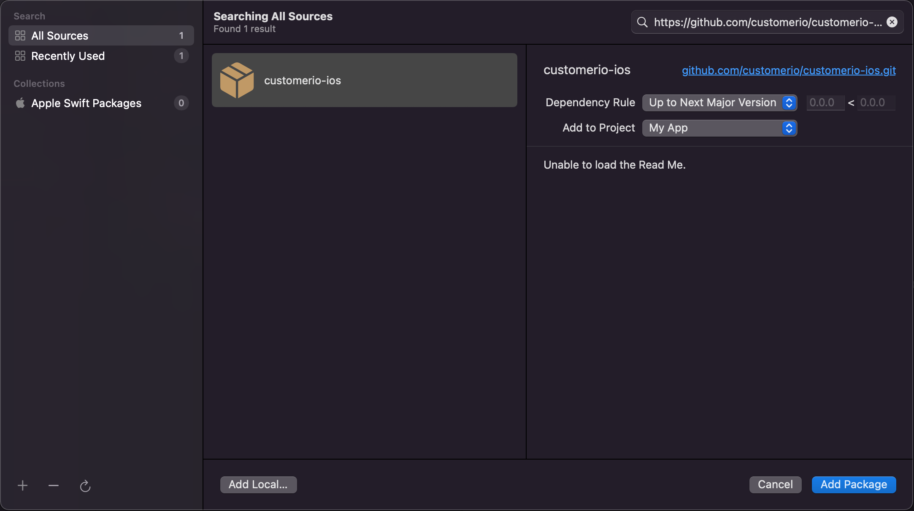

<p align="center">
  <a href="https://customer.io">
    
  </a>
  <p align="center">Power automated communication that people like to receive.</p>
</p>


[](code_of_conduct.md) 
[](https://codecov.io/gh/customerio/customerio-ios)

# Customer.io iOS SDK

This is the official Customer.io SDK for iOS.

You'll find our [complete SDK documentation at https://customer.io/docs/sdk/ios](https://customer.io/docs/sdk/ios/). This readme only contains basic information to help you install and initialize the SDK.

**The SDK has been tested on iOS devices**. It might work on other Apple devices—macOS, tvOS, and watchOS—but we have not officially tested, nor do we officially support, non-iOS devices.

### Using version 1 of our SDK? 

It's recommended to upgrade to using version 2 of the iOS SDK. [Check out our migration docs to learn how to update your app.](https://customer.io/docs/sdk/ios/migrate-upgrade/)

## Summary

To get started, you need to install and initialize the relevant SDK packages in your project. 

We've separated our SDK into packages to minimize our impact on your app's size. You should only install the packages that you need for your project. 

| Package | Required? | Description |
| :-- | :---: | :--- |
| Tracking | Yes | [`identify`](https://customer.io/docs/sdk/ios/identify/) people/devices and [send events](https://customer.io/docs/sdk/ios/track-events/) (to trigger campaigns, track metrics, etc). |
| MessagingPushAPN | No | [Push](https://customer.io/docs/sdk/ios/push/) and [rich push](https://customer.io/docs/sdk/ios/rich-push/) notifications using Apple's Push Notification service (APNs). |
| MessagingPushFCM | No | [Push](https://customer.io/docs/sdk/ios/push/) and [rich push](https://customer.io/docs/sdk/ios/rich-push/) notifications using Firebase Cloud Messaging (FCM). |

> Tip: Check out our [sample iOS app, Remote Habits](https://github.com/customerio/RemoteHabits-iOS), for a real-world example using our SDK. 

## Install the SDK

Follow **[Apple's instructions](https://developer.apple.com/documentation/swift_packages/adding_package_dependencies_to_your_app)** to add `https://github.com/customerio/customerio-ios.git` as a dependency to your project in Xcode and select the individual [package products](#sdk-package-products) that you want to install.

We recommend that you set the *Dependency Rule* to *Up to Next Major Version*. While we encourage you to keep your app up to date with the latest SDK, major versions can include breaking changes or new features that require your attention.



## Initialize the SDK

Before you can use the Customer.io SDK, you need to initialize it. Any calls that you make to the SDK before you initialize it are ignored. 

To get started, initialize the SDK in the `AppDelegate` `application(_ application: didFinishLaunchingWithOptions)` function: 

```swift
import CioTracking

class AppDelegate: NSObject, UIApplicationDelegate {
    func application(
        _ application: UIApplication,
        didFinishLaunchingWithOptions launchOptions: [UIApplication.LaunchOptionsKey: Any]? = nil
    ) -> Bool {
        CustomerIO.initialize(siteId: "YOUR SITE ID", apiKey: "YOUR API KEY", region: Region.EU) { config in 
          // optionally, configure the SDK for your app's needs
        }

        return true
    }
}
```

Then, when you want to use any of the SDK features, you use the shared instance of the class:

```swift
CustomerIO.shared.track(...)
MessagingPush.shared.application(...)
```

# More information

See our complete SDK documentation at [https://customer.io/docs/sdk/ios/](https://customer.io/docs/sdk/ios/)

# Contributing

Thanks for taking an interest in our project! We welcome your contributions. Check out [our development instructions](docs/dev-notes/DEVELOPMENT.md) to get your environment set up and start contributing.

> **Note**: We value an open, welcoming, diverse, inclusive, and healthy community for this project. We expect all  contributors to follow our [code of conduct](CODE_OF_CONDUCT.md). 

# License

[MIT](LICENSE)

