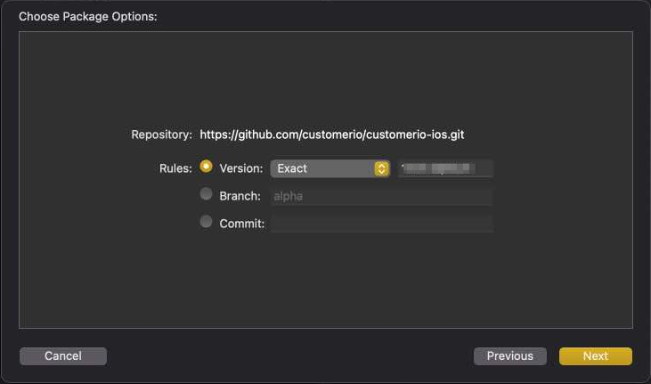

<p align="center">
  <a href="https://customer.io">
    
  </a>
  <p align="center">Power automated communication that people like to receive.</p>
</p>


[](code_of_conduct.md) 

# Customer.io iOS SDK

This is the official Customer.io SDK for iOS.

You'll find our [complete SDK documentation at https://customer.io/docs/sdk/ios](https://customer.io/docs/sdk/ios/). This readme only contains basic information to help you install and initialize the SDK.

Before you get started, keep in mind:
1. **The SDK has been tested on iOS devices**. It might work on other Apple devices—macOS, tvOS, and watchOS—but we have not officially tested, nor do we officially support, non-iOS devices.
2. **Our SDK is a work in progress!** While we're *very* excited about it, it's still in its **`alpha`** phase; it is not ready for general availability. If you want to try it out, contact [product@customer.io](mailto:product@customer.io) and we'll help set you up!

## Summary

To get started, you need to install and initialize the relevant SDK packages in your project. 

We've separated our SDK into packages to minimize our impact on your app's size. You should only install the packages that you need for your project. 

| Package | Required? | Description |
| :-- | :---: | :--- |
| Tracking | Yes | [`identify`](https://customer.io/docs/sdk/ios/identify/) people/devices and [send events](https://customer.io/docs/sdk/ios/track-events/) (to trigger campaigns, track metrics, etc). |
| MessagingPushAPN | No | [Push](https://customer.io/docs/sdk/ios/push/) and [rich push](https://customer.io/docs/sdk/ios/rich-push/) notifications using Apple's Push Notification service (APNs). |
| MessagingPushFCM | No | [Push](https://customer.io/docs/sdk/ios/push/) and [rich push](https://customer.io/docs/sdk/ios/rich-push/) notifications using Firebase Cloud Messaging (FCM). |

> Tip: Check out our [sample iOS app, Remote Habits](https://github.com/customerio/RemoteHabits-iOS), for a real-world example using our SDK. 

## Install the SDK

Use the Swift Package Manger to install our SDKs into your project.

1. In Xcode, go to **File** > **Swift Packages** > **Add Package Dependency**

2. In the window that appears, enter the iOS SDK's GitHub repository: 

```
https://github.com/customerio/customerio-ios.git
```

3. Select the version that you want to install. While the SDK is its alpha stage, we recommend that you install *an exact* version of the SDK instead of indicating a range. This prevents you from automatically upgrading to a newer alpha version and possibly installing breaking changes on your code base. 



4. Lastly, choose the SDK products that you want to install. You can start by selecting `Tracking` for now and adding others later if you need them. 


## Initialize the SDK

Before you can use the Customer.io SDK, you need to initialize it. Any calls that you make to the SDK before you initialize it are ignored. 

There are two ways to initialize the SDK. The method you use depends on how you want to use the SDK:

1. Singleton, shared instance (the quick and easy way):

When you use the shared instance, you don't need to manage your own instances of Customer.io SDK classes. To get started, initialize the SDK in the `AppDelegate` `application(_ application: didFinishLaunchingWithOptions)` function: 

```swift
import CioTracking

class AppDelegate: NSObject, UIApplicationDelegate {
    func application(
        _ application: UIApplication,
        didFinishLaunchingWithOptions launchOptions: [UIApplication.LaunchOptionsKey: Any]? = nil
    ) -> Bool {
        CustomerIO.initialize(siteId: "YOUR SITE ID", apiKey: "YOUR API KEY")

        // You can optionally provide a Region to set the Region for your Workspace:
        CustomerIO.initialize(siteId: "YOUR SITE ID", apiKey: "YOUR API KEY", region: Region.EU)

        return true
    }
}
```

Then, when you want to use any of the SDK features, you use the shared instance of the class:

```swift
MessagingPush.shared.application(...)
```

2. Create your own instances (better for projects using automated tests):

We recommend that you create your own instances of SDK classes if your project has automated tests. We designed our SDK with first-class support for dependency injection and mocking, which makes it easier to write automated tests. See [testing](#Testing) for more information.

> **Note**: Code samples in this readme use the singleton, shared instance method to call the SDK. However, all samples will also work with your own instances of SDK classes.

```swift
import CioTracking

let customerIO = CustomerIO(siteId: "XXX", apiKey: "YYY")

// You can optionally provide a Region to set the Region for your Workspace:
let customerIO = CustomerIO(siteId: "XXX", apiKey: "YYY", region: Region.EU)
```

Then, when you want to use any of the SDK features, you use the shared instance of the class:

```swift
let messagingPush = MessagingPush(customerIO: customerIO)

messagingPush.application(...)
```

# More information

See our complete SDK documentation at [https://customer.io/docs/sdk/ios/](https://customer.io/docs/sdk/ios/)

# Contributing

Thanks for taking an interest in our project! We welcome your contributions. Check out [our development instructions](docs/dev-notes/DEVELOPMENT.md) to get your environment set up and start contributing.

> **Note**: We value an open, welcoming, diverse, inclusive, and healthy community for this project. We expect all  contributors to follow our [code of conduct](CODE_OF_CONDUCT.md). 

# License

[MIT](LICENSE)

