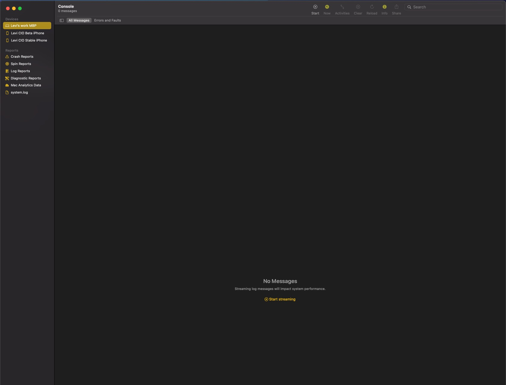
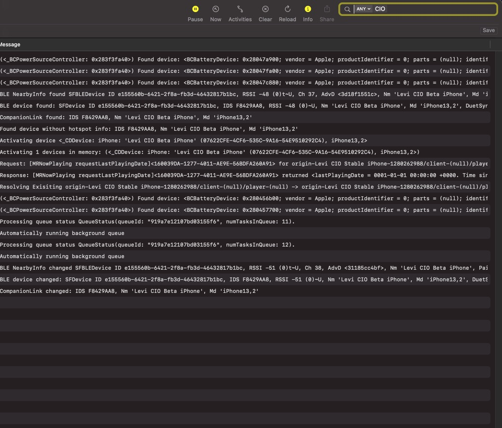
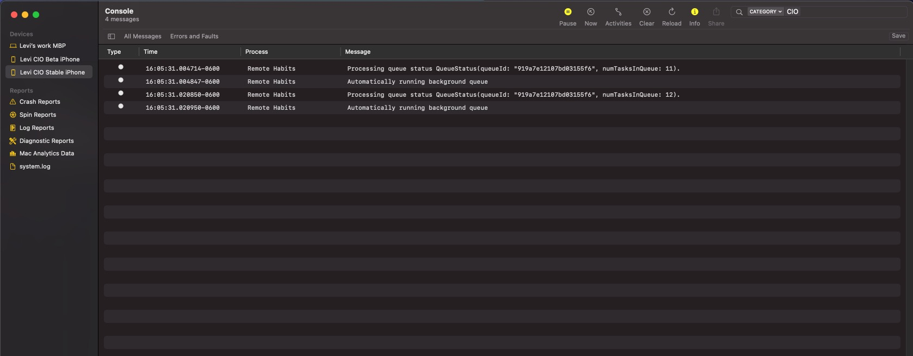
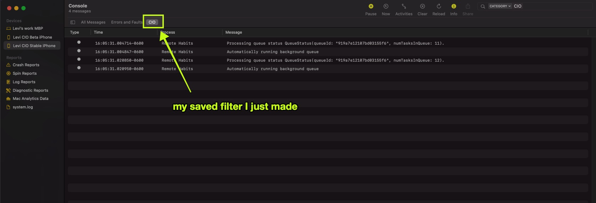

# Customer support 

### Install build of SDK from a git branch 

While helping you resolve your issue, we may have some code that we would like for you to test out for us to see if it solves your issue. To install this code into your iOS app, follow these instructions below. 

> Note: We do not recommend that you ship your app to production with a build of our SDK from a branch. Only ship your app to production with [official releases](https://github.com/customerio/customerio-ios/releases) of our SDK. 

For demonstration purposes, let's say that our support team has told you to install the git branch name `demo-bug-fix`. In the instructions below, replace `demo-bug-fix` with the branch name our support team has sent to you. 

* **Did you install our SDK into your app via Swift Package Manager (SPM)?**

Assuming that you have already [followed our instructions for installing our SDK via SPM](https://customer.io/docs/sdk/ios/getting-started/#install), navigate to Xcode > open your project settings > Package Dependencies tab > double click the `customerio-ios` SDK > select the "Branch" option, and enter in the branch name `demo-bug-fix` > Select "Done". 

If you have already followed these instructions and have installed a specific branch of the SDK, make sure that you have the latest changes of this branch installed. From Xcode > open "File" > Packages > Resolve Package Versions. 

* **Did you install our SDK into your app via Cocoapods?**

In your `Podfile`, replace any existing Customer.io entries that you have with these new entries:
```ruby
# Replace these:
pod 'CustomerIO/Tracking', "~> 2.0.0"
pod 'CustomerIO/MessagingPushFCM', "~> 2.0.0"

# With these:
branch_name = 'demo-bug-fix'
pod 'CustomerIOCommon', :git => 'https://github.com/customerio/customerio-ios.git', :branch => branch_name
pod 'CustomerIOMessagingPush', :git => 'https://github.com/customerio/customerio-ios.git', :branch => branch_name

pod 'CustomerIOTracking', :git => 'https://github.com/customerio/customerio-ios.git', :branch => branch_name
# If using FCM for push notifications, add the FCM module:
pod 'CustomerIOMessagingPushFCM', :git => 'https://github.com/customerio/customerio-ios.git', :branch => branch_name
# Or, use the APN push notifications module:
pod 'CustomerIOMessagingPushAPN', :git => 'https://github.com/customerio/customerio-ios.git', :branch => branch_name
# Do not forget to include "CustomerIOCommon" and "CustomerIOMessagingPush" as shown above. They are required 
# when installing branch builds. 
```

### How to capture logs from SDK to send to Customer.io team 

* Enable debug logging in your mobile app. 

> Note: We do not recommend enabling debug logs in production. Instead, enable them during development/testing. 

Every place in your code where `CustomerIO.initialize()` is called, enable the debug log level. This includes in the Notification Service Extension that you [setup for rich push](https://customer.io/docs/sdk/ios/push/#rich-push). 

```swift
// During SDK initialization, enable debug logs: 
CustomerIO.initialize(siteId: "YOUR SITE ID", apiKey: "YOUR API KEY", region: Region.US) { config in
  config.logLevel = .debug 
}
```

* Console (already installed on your mac) - This is a built-in application on your mac where you can view logs made from the SDK. Open up Spotlight or Launchpad on your mac and search "Console" and you will see a screen like this:



> Note: We recommend that you use Console instead of Xcode to view and capture logs from the SDK because Xcode may not show you all of the logs the SDK generates.

* Next, make sure to go to "Action > Include Info messages" and "Action > Include Debug messages" or you will not see any logs coming from the SDK. 

On the left, select your iOS device that you are running your app from with the Customer.io SDK installed in. If you don't see your device listed, plug in your iOS device into your mac via USB cable (try to use a direct connection via the Apple cable, using a USB hub might prevent the device from showing up). Then, click "Start streaming". You will instantly start to see hundreds or even thousands of logs printed to you. 99% of those are not relevant to you. That's why we will be filtering them away! 

* In the top right search box, type "CIO" and hit Enter. You will now see a dropdown with "ANY" in it:



* Click on the dropdown and select "Category". You will now only see messages that are sent from the SDK:



* In the top right, select "Save" button to save this filter. Next time you open Console, just click that saved filter along the top of the screen. 



* Saving console output from Console would be very helpful to the development team when you encounter issues. You can save logs in Console by clicking on any of the log entries on the screen (or Edit > Select All), CMD + C, then CMD + P into a text editor on your computer. Save the file as a .txt file. 

* You can send this log file to our support team at `win@customer.io`. When sending this file, please make sure to reference an existing GitHub issue URL or existing support email so we know what these log files are in reference to. 

