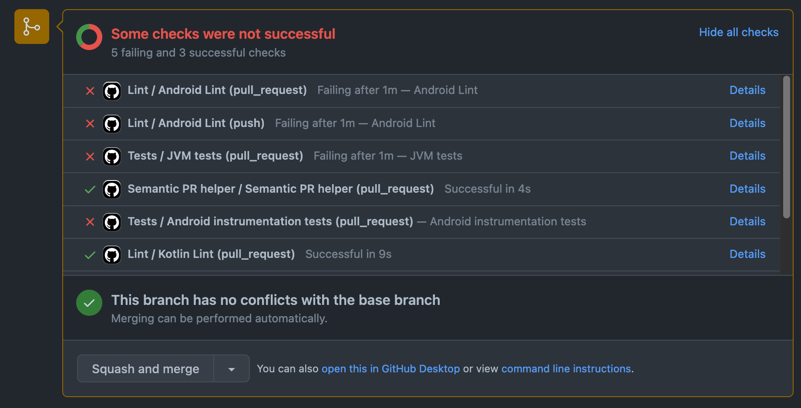
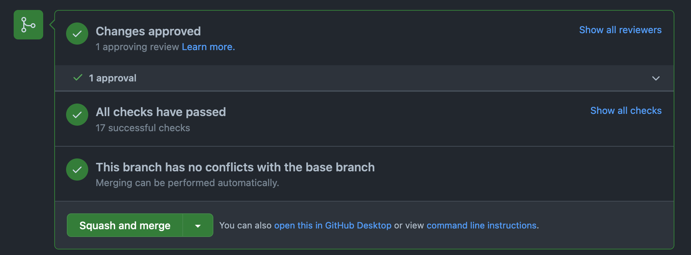

# Git Workflow 

This document goes over how we build features and make deployments on all the mobile repositories. We follow a specific workflow for this repository to make successful deployments for our customers. 

> Tip: If you have read this document already, you may want to [skip straight to the scenarios section](#Scenarios). 

# About the workflow 

The mobile projects follows [the popular workflow called `git-flow`](https://nvie.com/posts/a-successful-git-branching-model/). `git-flow` works well for the mobile projects because they each release different versions of `alpha`, `beta`, and `production` versions of software to the public. Go ahead and [read over the `git-flow`](https://nvie.com/posts/a-successful-git-branching-model/) workflow to learn about the details of it. 

The [article you just read](https://nvie.com/posts/a-successful-git-branching-model/) shows you how you can manually run `git` commands on a repository to merge in new features, fix bugs, and make deployments. Our team might need to perform some manual tasks, but we try to automate running these `git` commands as much as possible. Automating these tasks helps to (1) avoid human error and (2) allows you to focus on simply writing code and avoid having to learn how to deploy the code. We try to keep this workflow as simple as possible by automating much of it. However, there is always a chance of a step in the deployment process failing. This document goes over steps to take on how to manually deploy the software if ever needed. 

Let's get into the many scenarios that you may encounter when working on this project and how you could do those tasks. 

## Deployment flow 

To understand the `git-flow` workflow, you need to understand how code is deployed. 

To help describe the deployment flow, refer to this image from the `git-flow` article:


There is a lot going on with this image. Let's try and explain it a little bit. 
* **2 permanent branches** - The branches `main` and `develop` are permanent branches and they never get deleted from the repository project. `main` gets updated when a production deployment is made. `develop` is the default branch that code gets merged into that will be made into the next release of the software. That means that `develop` may contain commits that the branch `main` does *not* have yet but `main` should never have commits in it that are *not* in `develop`. 
* **Feature branches, bug fix branches, pre-release branches, etc** - All other branches (not `main` or `develop`) are temporary and get deleted after they have served their purpose. 
* **Make pull requests for all changes that you make to the project** - Any change that you make to one of the mobile projects should be merged into the project via a pull request on GitHub. That means that you should not be making commits to the branches: `develop`, `alpha`, `beta`, or `main`. 

* **The *pink dots* on the left hand side are new features** that you or your teammates are working on. You start a new feature by making a new branch off of the `develop` branch (or another feature branch if you need some code from that branch). It's important that new feature branches *do not* get created from release branches such as `alpha`, `beta`, or `main`. It's also important that new feature branches get merged into the `develop` branch, only. If your team made an `alpha` or `beta` release of your software yesterday and your new feature gets merged into `develop` today, your new feature should not get released until the current `alpha` or `beta` gets merged into production and then a new release is made in the future. 
* **The *yellow dots* are commits on the develop branch.** All pull requests and releases will eventually get merged into the `develop` branch. 
* **The *green dots* are for a new release.** Example: There is a new feature that is merged into `develop` that the mobile team decides they want to release to customers. To start this new release to customers, a **pre-release** branch is created (`alpha` branch in this scenario). Making this `alpha` branch will deploy a new alpha deployment of the software. 

> Note: Once a release has been started (when `alpha` or `beta` branch is created), *only bug fixes* should be merged into the release until it's in production. If you find a bug on the `alpha` or `beta` release, then you will make a new branch off of the `alpha` or `beta` branch and make a pull request with that fix back into `alpha` or `beta` branch. 

* **The *red dots* are hotfix** branches. Let's say that a customer finds a critical bug in one of our production releases. Our team may decide that we need to get this bug fixed as soon as possible and we decide to skip releasing this bug fix to `alpha` and `beta` and we deploy the bug fix immediately to production (after QA testing). To do that, you should make a new branch off of `main` (aka the latest production code), fix the bug, then make a pull request into `main`. When the pull request gets merged, there will be a new production deployment in production. 

* **Finally *the blue dots* are git tags**. Git tags [are all deployments](https://github.com/customerio/customerio-ios/tags) that you have made for your software. When any deployment is made, a git tag gets made. 

With all of that explained, lets go over some common scenarios that you will encounter while working on this project. In fact, it might be a good idea to [click this link](#Scenarios) and then bookmark it in your browser so it's convenient. 

# Scenarios 

## Build a new feature 

Want to build a new feature? Here is how you would do that. 

#### Simple method

1. Create a new branch for your feature. We like to name our branches `<your-name>/<feature-description>`. For example, if my name is Dana and I was to add a feature to allow customers to edit their photo on their profile, I would create a new branch `dana/edit-picture-profile`. Make this new branch off of the `develop` branch. 
2. When you're done making this feature, make a pull request merging your branch *into the `develop` branch*. Features should *not* be merged into a release branch (`alpha`, `beta`, `main`). Your feature will be released to the public the next release that your team makes. 

#### Need to use code from another branch? 

1. Let's say that another member of your team, Bradley, is building a feature that allows users to upload photos in the app. Bradley is currently working on this feature on the branch named `bradley/upload-photos`. You need that feature in your new feature you're working on for editing profile pictures. You can either make your new branch off of the `develop` branch and merge in Bradley's work (`git merge bradley/upload-photos`) or you can simply make your new feature branch from Bradley's branch: `git checkout bradley/upload-photos && git pull && git checkout -b your-name/edit-picture-profile`. 

2. When you're done with your feature and it's time to make a pull request, create a pull request *setting the base branch* to `bradley/upload-photo`. If Bradley's pull request has already merged into `develop`, however, then create a pull request setting the base branch to `develop`.  

   >  Note: The main reason why we prefer that you create pull requests setting the base branch to `bradley/upload-photo` is because it makes reviewing pull requests much easier. If you were to merge the branch `bradley/upload-photo` into your branch and then make a pull request into `develop`, GitHub would show all commits you made *and* Bradley made in their branch. We want the pull request to only show *your* changes. If you set the base branch to `bradley/upload-photo`, GitHub will hide Bradley's commits and only show changes you made. When you create a pull request, you know that you did it correctly if you go to the "Files changed" tab in the pull request and you only see changes that you made, not Bradley. 

   

#### Working on a big feature? 

Are you working on a feature that will take a week or longer to complete? When you're working on big features, your team members will greatly appreciate if you make multiple small pull requests for this feature to make reviewing your work much easier. Small pull requests are *always* appreciated! 

1. Create a new branch for your new feature. Let's say that you're building a new feature to edit a profile in an app. This feature has a lot of steps to it including uploading photos, editing name, selecting address on a map, etc. Create a new branch called `edit-profile` from the `develop` branch and then push it to GitHub (yes, push your new branch to GitHub even though you have not made any commits on it yet). This is the branch that we will merge into `develop` after you have built the entire feature. 

2. All of your work on this big feature is a sequence of steps: add ability to upload photos in app -> add feature to profile page to edit profile photo -> add feature to edit name on profile page -> etc. In each step you are adding code from the step before. For example, you can't add a feature to edit a profile picture until you add the ability to upload photos into the app. 

   So, first, create a branch to add the ability to upload photos in the app: `git checkout -b your-name/add-ability-upload-photos`. Write the code to complete this feature. When it's time to make a pull request, create a pull request setting the base branch to `your-name/edit-profile` that you created in the last step. This will allow your team members to review your pull request showing *just* commits made to upload photos. 

3. After you create the pull request, you are ready to start on the next step of your big feature which is editing of a profile photo in the app. You need the code that you just wrote in branch `add-ability-upload-photos`. So, make a new branch off that branch: `git checkout your-name/add-ability-upload-photos && git checkout -b your-name/edit-profile-picture`. Write the code to complete this feature. When it's time for you to create a pull request, set the base branch to `your-name/add-ability-upload-photos`. If `add-ability-upload-photos` pull request has already been merged, however, you can set the base branch to `your-name/edit-profile` that you created in step 1. 

   Know that eventually, all of your branches that you make for `edit-profile` will eventually get merged into the branch `your-name/edit-profile`. 

4. Let's say that 2 weeks have gone by. You have completed all of the work for editing a profile. This big feature is done. Congrats! 
   Make sure that all of the pull requests that you have made up to this point are merged into the branch `your-name/edit-profile`. This means that `your-name/edit-profile` is complete and contains all of the code for this big feature. Next is to merge it into `develop`! 
   
   Create a new pull request for `your-name/edit-profile` setting the base branch to `develop`. No need to get any pull request reviews for this pull request because all of the commits you made up to this point have been reviewed. So, you can go ahead and just merge the pull request into `develop` after all of the GitHub Status Checks in the pull request are successful. 
   
   

> Here, you see that this pull request on GitHub has failed status checks. Make sure to fix all of the errors in tests and lint before merging your pull request. 



> This pull request on GitHub has all of the status checks passing. That means the pull request is ready to merge! 


## Fix a bug 

Where does this bug exist? Depending on where the bug exists will determine what you should do.

> Note: When making a bug fix pull request, it's preferred that you include automated tests (unit test function, integration test, etc) in this pull request that reproduces the bug. This is to help us feel confident the bug is indeed fixed and it will not come up again in the future. 


## Where did you find this bug? 

### In an `alpha` or `beta` release of the software (the version of the release ends with `-alpha.X` or `-beta.X` such as `1.0.0-alpha.1`)

Let's use an example. Let's say that during the QA process, the QA team found a bug in the latest Alpha release of the code. To fix this bug, follow these steps:

1. Create a new git branch off of the `alpha` branch
2. Fix the bug
3. Make a pull request setting the base branch to  `alpha` 
4. After the pull request gets reviewed and merged, a new Alpha release will be made with this bug fix. The QA team can then test to make sure the bug no longer exists. 

### **In a production release** of the software (the version of the release does *not* end with `-alpha.X` or `-beta.X` such as `1.0.0`)

1. Make a new git branch off of the `main` branch
2. Fix the bug
3. Make a pull request setting the base branch to the  `main` branch. 
4. After the pull request gets merged, a new production release will be made to customers containing your bug fix. 

### In the `develop` branch for a feature that was built recently

1. Make a new git branch off of the `develop` branch
2. Fix the bug
3. Make a pull request setting the base branch to the `develop` branch
4. After the pull request gets merged, a deployment will *not* be made with the bug fix. The bug fix will get deployed when your team decides to make a new release of the code and the recently built feature will also be released at this time. 
   


## Make a new release 

Ready to make a new Alpha, Beta, or Production release of the software? Yay! Let's get into how we do that. 

Open the GitHub webpage for the mobile project you want to make a release for. Select the *Actions* tab > Select *Promote a release* > Select the button *Run workflow* > For the dropdown *Use workflow from*, you need to select a branch name. This is the branch that contains commits that you want to promote: 

* If you want to make a new Alpha release, select the `develop` branch. 
* Want to make a new Beta release? Select the `alpha` branch. 
* Want to make a new Production release? Select the `beta` branch. 

Click *Run*. After you do this, this will start the sequence of automatically deploying the SDK code for you. 

Done! You shouldn't have to do anything else at this point to make a release. There is a chance that a failure will occur during the deployment process. The automated deployment process should send messages to the mobile Slack channel when a deployment is successful or failure. You can keep an eye on Slack during the deployment process. If there is a failure, read the message in Slack for help on how to fix the deployment step. 

To help you better understand the automated deployment process and to fix deployment failures, you can read the sections below: 

## The deployment process 

Read this section to learn about the steps taken to deploy the code base and how to fix each of the steps if there is an error encountered. 

The deployment process goes through these 3 steps:

### 1. Creating or updating git branches for the release.

Remember the green dots discussed in the section [Deployment flow](#Deployment-flow)? We need to perform some git commands in order to merge commits into a release branch, and optionally delete branches after they are no longer needed. 

This deployment step is run when you use the *Promote a release* button in GitHub *Actions* tab as discussed in section [Make a new release](#make-a-new-release). 

**Did you encounter a problem with the automated release and you need to manually perform this step? Follow these steps:**

* Run these `git` commands from your computer:


   ```bash
   git fetch
   
   // TODO update these instructions. the command should be printed from the git bot for promote. 
   
   git switch develop
   git pull
   
   git checkout -b alpha
   git push origin alpha 
   ```

* Tell the team that you encountered an issue with making an automated release so it can be fixed. 

### 2. Determine the next semantic version and create a new git tag

What version of the SDK are you releasing? `1.5.7`? `5.8.1-alpha.4`? This version number is called the [semantic version](https://semver.org/). We need to determine the next semantic version number to use for this new release. 


We use a tool called [semantic-release](https://github.com/semantic-release/semantic-release) to automate the process of determining the next semantic version number and creating a git tag. Semantic-release runs automatically when any of the release branches (`alpha`, `beta`, `main`) have new commits pushed to them. This means that when you follow the step above of *Creating or updating git branches for the release*, the CI server should automatically run semantic-release for you. 

But if semantic-release fails to run, follow these instructions to manually perform this deployment step: 

* Find the semantic version *from the last release* that was done. You can view a list of all previous releases for a mobile project by viewing all previous git tags created for the project. [Here is the webpage](https://github.com/customerio/customerio-ios/releases) for the iOS SDK `https://github.com/customerio/customerio-ios/releases`. Each of the mobile SDKs have this `/releases` GitHub URL available for the GitHub repo. 

  Note that the last release of the software could be a previous production release (example: `3.7.1`), a previous Alpha release (example: `3.7.1-alpha.3`), or a previous Beta release (example: `3.7.1-beta.1`). 

* Next is to determine the next semantic version number based off of the latest release done. Take the version from the last release and then follow these steps to determine the next version:

  [](https://mermaid-js.github.io/mermaid-live-editor/edit#pako:eNqNlG1P2zAQx7_KkTcpiFpjnTYUTVQFCusGaNImDUagcuNL6xHbmeOOVpTvvnMe-sCDxKskl3v4-X_newgSIzCIgrHl-QR-Hsf6y_UvXoCbIGS8cGAxQ14gmLS0FSZ199wi9LJ8wsFYOETHuzfQbh8srrBYwOC6R7_nZgq5Nco4qcdlZJ2o-3lkD_ozrvIMIzg1_ndKjnVCZ8qE4L2a7N743RoxTZw0unsT68Gq3NfWIIXxK2l2wfE7rMC5wjJpgYprJxP4h7agfMC1AC4EhO0RhbC90Ef7ENRiA7bD9vdZp819BfYR2geNpYrzvpssz-FXQN67FLh0alj0VI3QlkiC9HLYUF2GPqDMWqMxWILtsU6HvasxPFdl2KZmlkJdmAWcLdtSARJWYpFTBQ4a72vdmiaRxmcrjc9bJybLzH1ZWuPMkYjOT4TUhbPVyYoSmhx0LWYl04aabENOgiTo2o1Yz31B6DXd9dDfWgNNlAq1q2rX8rgX-_OefWJ7lQodr8La9wfKH-vedU_PITFKSVfQUzsuCRfCrZCOAtJ1G00hTEmbrQiSCddjZIyFayN--ARrR_E_xu48H62K10Nesiv227_cDodDguktz3j0IlRZPwq7qyZXFi_uE5rjZzRSv5VmOLwtcY6WOP3XNErlbI2n-gYpqKpM54S0RnTylCjnLpm8lWh4S0D9JdBp68LQZcgzM6fZQ4FiC8hSNQYUF9hMmF9lPsXI7ys34X55_Z1KizSbr-2x7WA3UGgVl4K24EOsAeKAHBTGQUSvgtu7OIj1I_lNc0H3pS-kMzaIUp4VuBvwqTM_5joJIroJ2DgdS04bVdVej_8BelnOEQ)

  > Tip: Want to edit the graph above? Just click it > edit graph > replace markdown in this document with new markdown URL from your edits. 

* After you determine what the next semantic version should be, you want to go into the code and edit metadata files with the newest version. Each SDK project contains a script that updates the version files for you. You should be able to run this command in each of the SDK projects: `./scripts/update-version.sh "new-version-here"` and the files of the project will be updated for you. 
  // TODO make sure each project contains this script to update version. the script can suggest a git commit message for you to make. 

* After you edit the metadata files, you will want to make a git commit. Make the commit's commit message with this format: `chore: prepare for <next-semantic-version>` like [this example git commit has done](https://github.com/customerio/customerio-ios/commit/bfcaeea962dcf196118550ee38ca26419e9d2069). 

* Last step! Create a git tag and then push the new tag to GitHub. Run `git tag "next-semantic-version" && git push --tags` from your development machine. You should now be able to go into the SDK GitHub repository, add `/tags` to the URL to go to the latest tags page. You should see your git tag that you just pushed. 

### 3. Deploy code to server for customers to use the deployment.

The last step of the deployment process is pushing the code to a server so that customers can use it. Each of the mobile projects are setup to automatically deploy code to a server after a git tag is created and pushed to GitHub. This means that when you follow the step above of *Determine the next semantic version and create a new git tag*, the CI server should automatically deploy the code to servers for you. 

However, if for some reason the CI server fails to deploy to a server automatically for you and you decide to deploy the code manually, here is how to do it. Each of the mobile projects contains a script that will do the deployment for you. You should be able to run this command in each of the mobile projects: `./scripts/deploy-code.sh` and it will do the process of uploading the code to the deployment servers for you. 

// TODO make sure each project contains this script to deploy 
